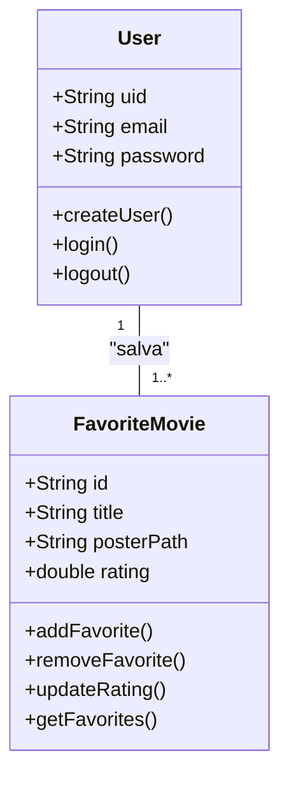
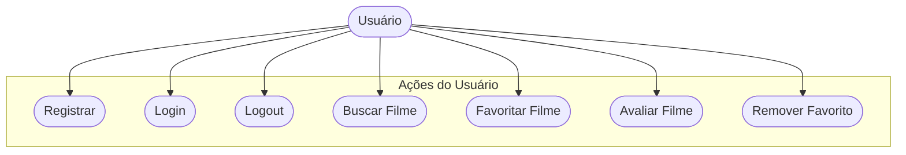
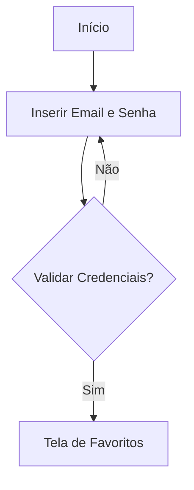

# 🎬 CineFavorite — Aplicativo de Filmes Favoritos

O **CineFavorite** é um aplicativo mobile desenvolvido do zero, com o objetivo de permitir que cada usuário crie uma conta, busque filmes em uma API externa e monte sua própria galeria personalizada de **filmes favoritos** — com **posters, notas e avaliações**.  

---

## 🎯 Objetivos do Projeto

- Criar uma **galeria personalizada** de filmes favoritos por usuário  
- Conectar o app a uma **API de filmes (TMDB)**  
- Implementar **autenticação de usuários** (criação de conta, login e logout)  
- Permitir **busca de filmes** por palavra-chave  
- Oferecer uma interface **intuitiva e moderna** desenvolvida no **Figma**

---

## 📋 Levantamento de Requisitos

### ✅ Requisitos Funcionais
- O usuário deve ser capaz de **criar uma conta** e **fazer login/logout**  
- O sistema deve permitir **buscar filmes** por nome (via API TMDB)  
- O usuário poderá **adicionar ou remover filmes favoritos**  
- O usuário poderá **atribuir notas** aos filmes adicionados  
- A galeria de filmes deve ser **personalizada para cada conta**  

### ⚙️ Requisitos Não Funcionais
- O sistema deve utilizar **Firebase Authentication e Firestore**  
- O design deve seguir **boas práticas de UX/UI** (prototipado no Figma)  
- A aplicação deve ser **responsiva, fluida e performática**  
- O código deve ser **organizado e modular**, com boas práticas de Flutter/Dart  

---

## 🧰 Recursos Utilizados

| Recurso | Descrição |
|----------|------------|
| **Flutter / Dart** | Framework para desenvolvimento mobile multiplataforma |
| **Firebase** | Autenticação e banco de dados em nuvem (Auth / Firestore) |
| **TMDB API** | API para buscar informações e imagens de filmes |
| **Figma** | Protótipos e design da interface do usuário |
| **VS Code** | IDE utilizada para codificação e testes |

---

## 🧱 Diagramas do Projeto

### 🧩 Diagrama de Classes
Representa as principais entidades e seus métodos dentro do sistema:

---

### 🎭 Diagrama de Casos de Uso

Demonstra as ações possíveis dentro do app.

---

### 🔁 Fluxo de Login

Exemplo do fluxo de autenticação do usuário.

---

### 🧠 Prototipagem
A prototipagem foi feita no Figma, priorizando uma interface moderna, intuitiva e fácil de navegar.
O foco é oferecer uma experiência fluida e centrada no usuário, valorizando imagens e notas dos filmes.

---

### 💻 Codificação
A codificação foi feita em Flutter com integração Firebase e API TMDB, seguindo arquitetura modular e boas práticas de organização de código.
Cada módulo foi separado em pastas para facilitar manutenção e escalabilidade futura.

---

### 🚀 Conclusão
O CineFavorite é mais que um app de filmes — é uma experiência personalizada de cinema no seu bolso.
Com integração de dados, design moderno e autenticação segura, o projeto representa uma aplicação completa de ponta a ponta em Flutter.
